# Supply Chain Insights

>Use Supply Chain Insights to predict, assess, and mitigate disruptions and 
ultimately optimize supply chain performance

When everything is going all and well, details such as which route your carrier took to deliver your 
package to your customer seem completely immaterial. But what happens when a massive storm hits, 
and you realize that all of your carriers are stuck in the storm, and none of your packages will
be delivered on time? You've just broken your promise to your customers, and more likely than not, you'll
have to deal with angry customers demanding refunds, all because you didn't have the visibility into 
your end-to-end supply chain. This is where Supply Chain Insights comes in.

IBM's Supply Chain Insights provides your organization with end-to-end visibility throughout all stages of the supply chain lifecycle - starting from planning and sourcing, all the way to delivery and service, and everything in-between. Not only that but Supply Chain Insights is a collaboration platform; it enables businesses to set up resolution rooms to discuss and take action on problems that inevitably arise during the supply chain process. Now, Supply Chain Insights, like any other artificial intelligence application, is only as good as the data that you give it. To make things simple, Supply Chain Insights allows for two ways to upload data into the platform - one via Excel sheet upload, and the other via REST APIs. This 
pattern will show you how to you to get your account, upload data, and integrate with external data 
sources such as UPS, and ultimately make better supply chain decisions. 

Audience level : Intermediate Developers

🚨
**Note: Supply Chain Insights will be abbreviated to SCI for short.**
🚨

When you have completed this code pattern, you will understand how to:

* Upload orders, shipments from an Excel spreadsheet
* Use APIs to automate and upload large batches of orders and shipments
* Automate updating external shipment data (from UPS or Fedex) to increase response
time of supply chain events.

# Architecture flow

<p align="center">
  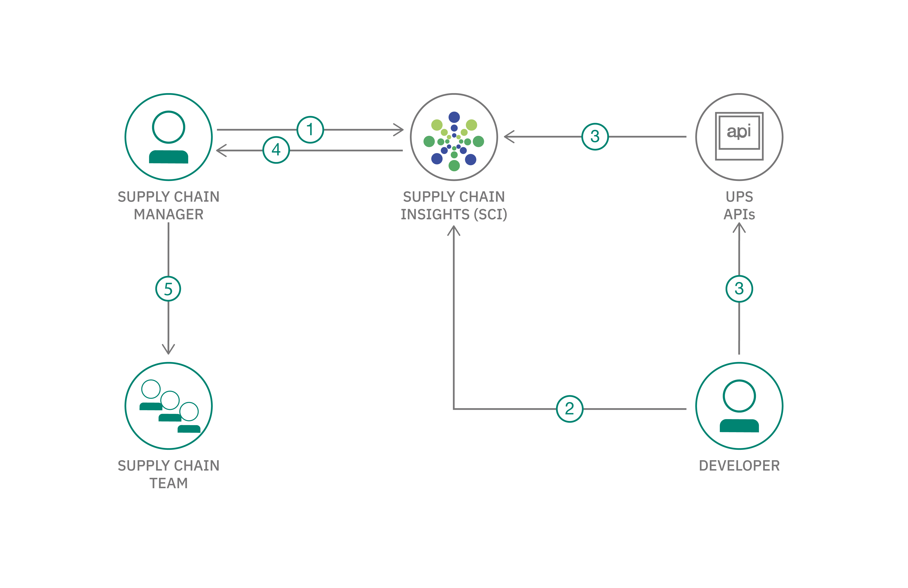
</p>

1. The developer uploads existing shipment information using Excel.
2. The developer uses APIs to automate uploading of large batches of 
orders and shipments.
3. The developer uses UPS API's to gain real-time information about the 
current location and estimated time of delivery for shipments. 
4. Supply Chain Insights offers valuable advisories depending on the UPS 
information about the current location and estimated delivery. 
5. The supply chain team goes into resolution rooms to plan how best to mitigate 
disruptions predicted by advisories. 

# Included components
* [Supply Chain Insights](https://www.ibm.com/us-en/marketplace/supply-chain-insights) Capitalize on AI to break free from supply chain visibility challenges and act with confidence.

## Featured technologies
- [Node.js - latest LTS](https://nodejs.org/en/) 


# Watch the Video Part 1 - Platform overview (no code)
[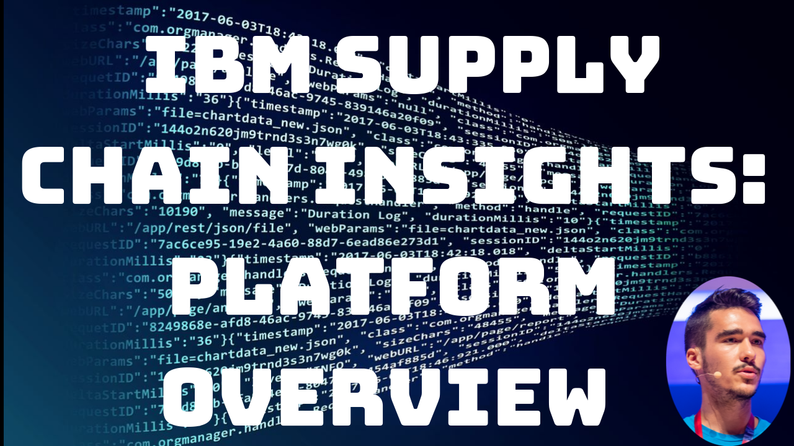](https://www.youtube.com/watch?v=FWDX8DA4-Wo)

# Watch the Video Part 2 - Getting your account, upload data using Excel (no code)
[](https://www.youtube.com/watch?v=rYoPCnxkIFw)

# Watch the Video - Part 3 - Integrating w/ UPS APIs (code tutorial)

[](https://www.youtube.com/watch?v=k_i-UcLWwnA)


### Prerequisites
- [IBM ID](https://www.ibm.com) 
- [Supply Chain Insights account](https://www.onlinedigitallearning.com/mod/page/view.php?id=59722&forceview=1)
- [Node.js - Latest](https://nodejs.org/en/) 


# Steps

1. [Get an IBM ID](#step-1-Get-an-IBM-ID)
2. [Get a Supply Chain Insights trial account](#step-2-Get-a-Supply-Chain-Insights-trial-account)
3. [Upload existing orders and shipments from spreadsheet](#step-3-Upload-existing-orders-and-shipments-from-spreadsheet)
4. [Get API Credentials](#step-4-Get-API-credentials)
5. [Use Supply Chain Insights API to gain visibility into your customers](#step-5-Use-Supply-Chain-Insights-API-to-gain-visibility-into-your-customers)
6. [Use Supply Chain Insights APIs to add product data](#step-6-Use-Supply-Chain-Insights-APIs-to-add-product-data) 
7. [Use UPS APIs to add location and delivery estimate data ](#step-7-Use-UPS-APIs-to-add-location-and-delivery-estimate-data) 
 
# Step 1. Get an IBM ID

<br>
<p align="center">
  
</p>
<br>

The first step to getting your free trial of Supply Chain Insights (SCI for 
short) is to get an IBM ID. First go to [ibm.com](https://www.ibm.com) and in the 
top-right corner, click on the icon of a person. From there, click on **My IBM**. 
From there, click on **Create an IBM ID** and fill out the form. Note that the 
email you use here will need to be valid, since you will be emailed your trail 
account for SCI to the email you use to create your IBM ID. Now that you have 
created your IBM ID, let's request your SCI trial.


# Step 2. Get a Supply Chain Insights trial account

<br>
<p align="center">
  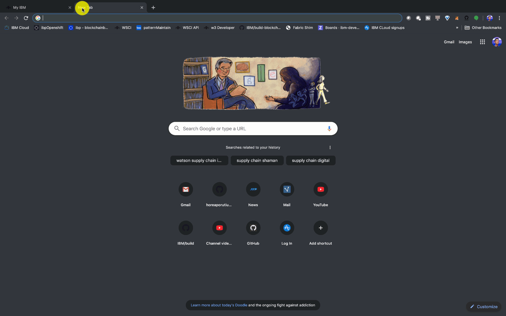
</p>
<br>

To get a  Supply Chain Insights trail account, we must first register 
for a course that gives us access to this account. Let's go to 
[IBM Training and Skills site](https://www.onlinedigitallearning.com/course/index.php). You will likely be asked to login with your IBM ID. Once there, 
search for **DL25400G**. You will see a couple results, click on 
**IBM Supply Chain Insights: Getting Your Learning Environment**. Inside the 
course, you will see a few links, click on **Requesting your learning environment**.
From there, fill in the form with your IBM ID email, and then click on 
**Create Request**. The request must be processed by IBM, and can take **up to 
one business day** to complete. I.e. if you request it on Friday, you may only get 
access to your account on Monday. 

Go ahead and check your email that is associated with your IBMid.
Once you get your email granting your access 
to your SCI trial, we are ready to get started!


# Step 3. Upload existing orders and shipments from spreadsheet

<br>
<p align="center">
  
</p>
<br>

Our first exercise upon getting our SCI account is uploading data from a 
spreadsheet. Go ahead do a git clone to download all of the files from 
the repo, which includes the Excel spreadsheets.

```
testDir$ git clone https://github.com/horeaporutiu/supply-chain-insights

testDir$ cd supply-chain-insights/ 


```

You'll see in this repo, that we have the **product-spreadsheet.xlsx** 
and **product-inventory.xlsx** files. First, let's update the spreadsheets
to use our own initials instead of **RTA**. Update the files, and save 
them. Since my initials are HP, my spreadsheet will show 
**HP-SA-2019-V1**.

Now, log into [IBM Supply Chain Insights](https://www.ibm.com/customer-engagement/supply-chain/launch/) with your IBM ID and 
password you created in step 1.

<br>
<p align="center">
  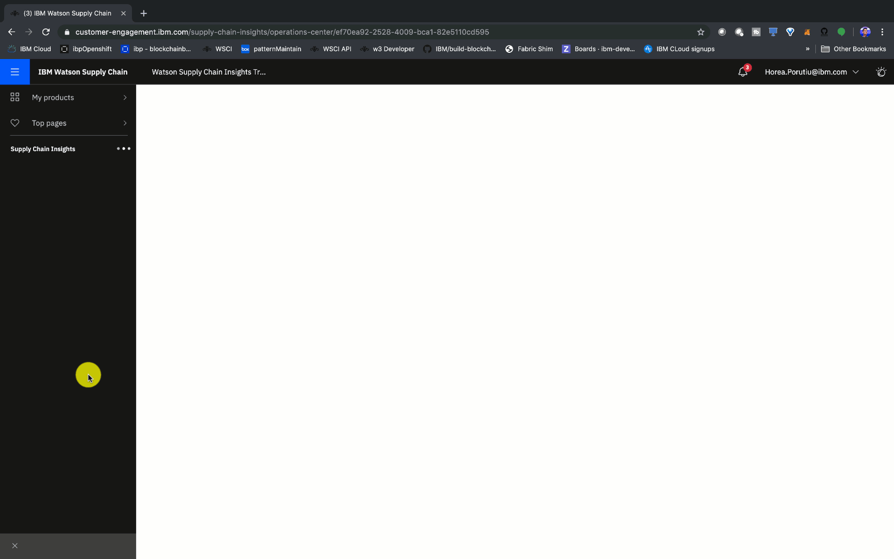
</p>
<br>

From the left-hand panel of the SCI dashboard, click on **Data**, which
is right above the **Settings**. From there, click on **Upload**. From 
there, navigate to **product-inventory.xlsx** from within your cloned
repo. You should see something like `This upload is similar to files that were previously uploaded. Select one of these mappings?
You can edit the mapping or make a copy if necessary.` Go ahead 
and click on **Select a type** under the main panel which shows 
11/12 fields matched.

<br>
<p align="center">
  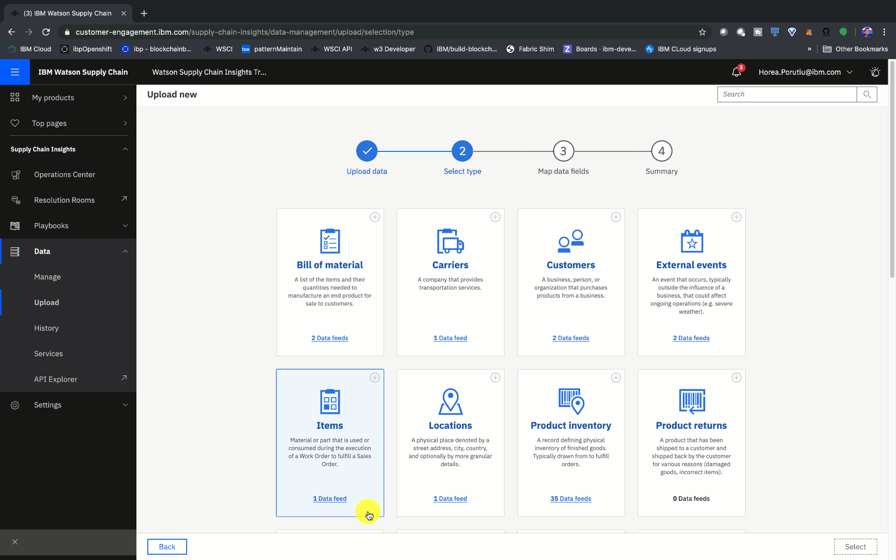
</p>
<br>

On the next screen you should see a lot of panels. Go ahead and select **Product Inventory**. You should 
see a pop-up which says **Time to map your upload!** Click on `Continue`.

Then, under **Your data fields** click on **Select an option** and click 
on **Inventory Location**. On the bottom, you should see **11/12 mapped**.
Click on **Next**.

The next page will say **Your data is uploading**. Click on **View History**. Next, 
click on **Refresh data**. You should now see that your data has been uploaded 
with a timestamp from the current date!

There, at the top of the page you should see **product-inventory**. If you
click on the right-arrow, you should see **8 records processed**. Nice job!

You now know how to upload data through Excel spreadsheets! 

# Step 4. Get API Credentials

<br>
<p align="center">
  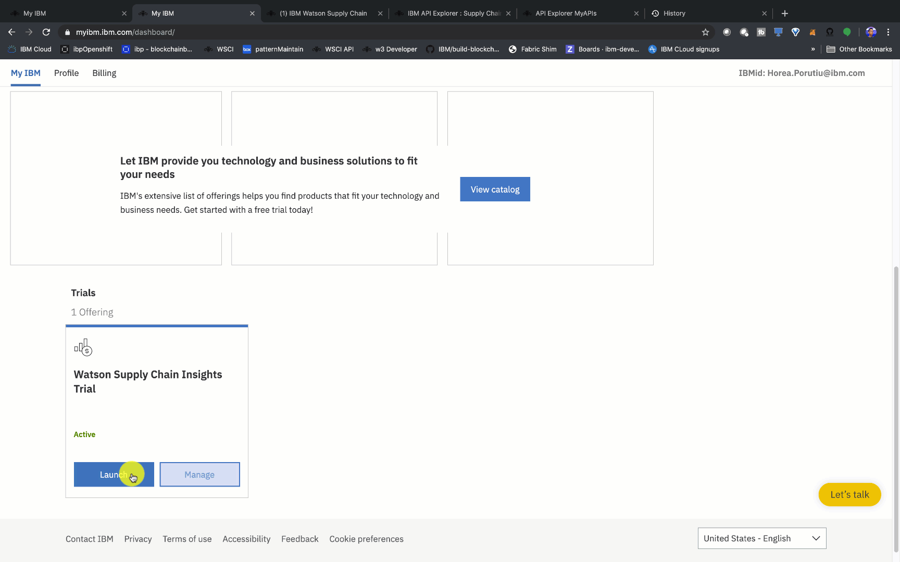
</p>
<br>

APIs for SCI enable you to load, update, and delete data. The first 
thing we need to do before we can use the API is to get our credentials.

We need three credentials:

1. X-IBM-User-Secret
2. X-IBM-Client-Id
3. X-IBM-Client-Secret

To retrieve the first two, from the SCI home dashboard, click on
**Settings -> Build info**. From there you should see 
your **X-IBM-User-Secret** and **X-IBM-Client-Id**

To retrieve the **X-IBM-Client-Secret**, click on **RESTful APIs**
under API access. This will take you to the SCI API explorer page.
Click on **My APIs** in the top-right corner. To the right of 
**Supply Chain Insights** you'll see a key icon, go ahead and click
on that. Once you click the icon, you'll see two sets of credentials
one with a lock icon, and one with a key icon. If you hover over the 
key icon you can see it says **X-IBM-Client-Secret** - then click 
**SHOW** and save your **X-IBM-Client-Secret**.

🚨
**Note: You will have to update your [config.js](https://github.com/horeaporutiu/supply-chain-insights/blob/master/config.js) file client secret, user secret, and user id fields with the credentials you just got above.**
🚨

At first the [config.js](https://github.com/horeaporutiu/supply-chain-insights/blob/master/config.js)
file will look something like this:

<br>
<p align="center">
  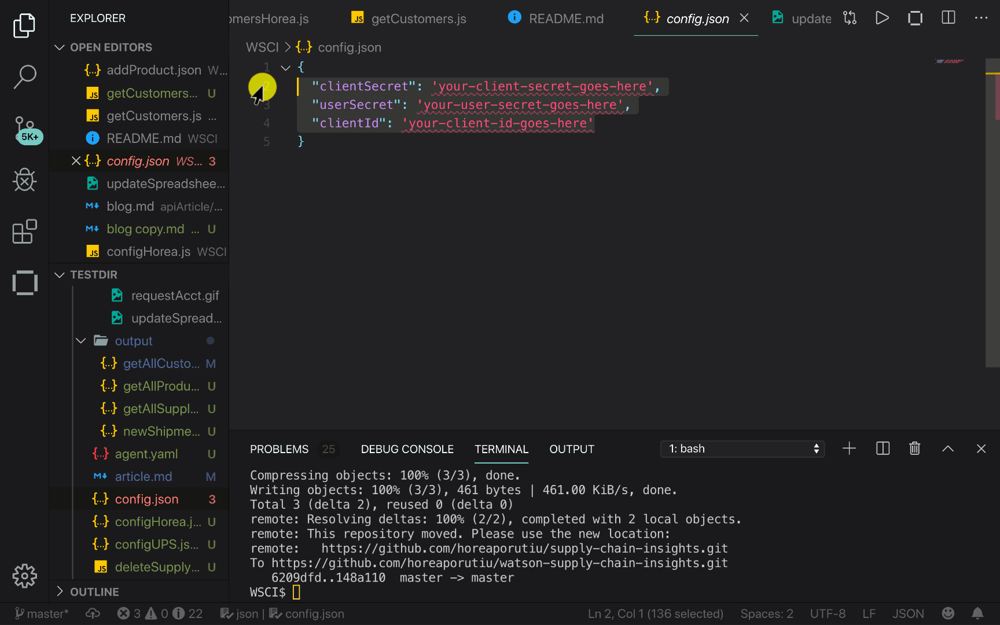
</p>
<br>


```javascript
module.exports = {
  "x-ibm-client-secret": 'your-client-secret-goes-here',
  "x-ibm-user-secret": 'your-user-secret-goes-here',
  "x-ibm-client-id": 'your-client-id-goes-here'
}
```

Once you update and save the file, it should look something like this:

```javascript
module.exports = {
  "x-ibm-client-secret": 'yD4cI3jO8tE3wN7hO123fsdfacQ4wM6lQ6oX8pN1bA8iF',
  "x-ibm-user-secret": 'a6f24a5dafsdfsdfb3e6-952c909cec34',
  "x-ibm-client-id": '9e1fafafb14b-4211-a540-2627bc0321b4'
}
```

Note these are fake credentials ^^.

Nice, you are now ready to use the SCI APIs!

# Step 5. Use Supply Chain Insights API to gain visibility into your customers
<br>
<p align="center">
  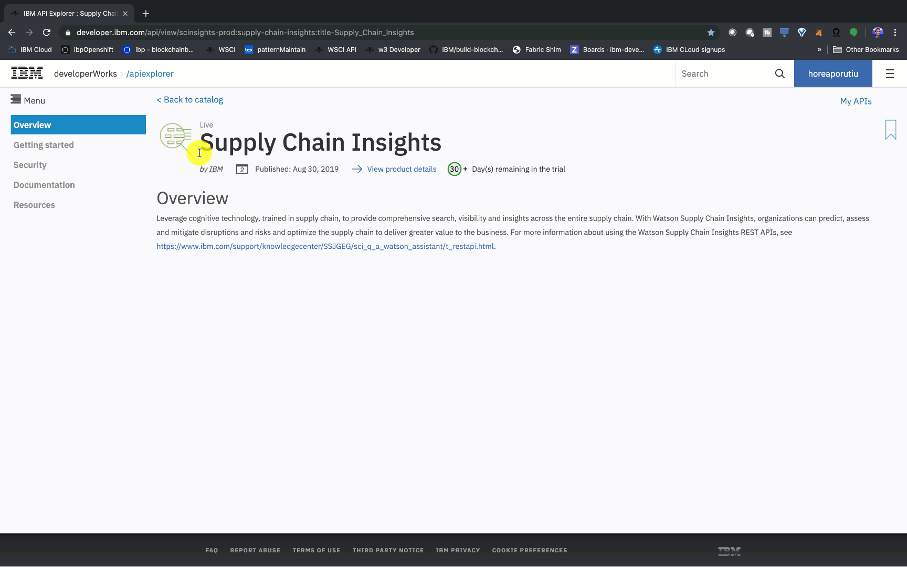
</p>
<br>

Let's first go to the SCI [API documentation page](https://developer.ibm.com/api/view/scinsights-prod:supply-chain-insights:title-Supply_Chain_Insights#doc) From there, let's try out first API request to find customers. 
In your cloned repo, you should see a script that is called
`getCustomers.js`. This script, along with a lot of the other scripts
we will run, use the base api 
`https://api.ibm.com/scinsights/run/api/`, but this one in specific 
looks to get all of the customers we have stored in SCI. This is 
why the URL we will make a API request to is the following:

`url: 'https://api.ibm.com/scinsights/run/api/customers'`

Our script uses the [HTTP request client](https://github.com/request/request) package to make API calls. It also uses the [fs](https://github.com/nodejs/node/blob/master/doc/api/fs.md#fswritefilefile-data-options-callback)
module to write the output from the API request to a file. 

Note that all of the output files will be created in the `output` 
directory, which at first, is empty.

At the top of the file, we import the `request` and `fs` libraries
with the following code:

```javascript
const request = require("request");
const fs = require('fs');
```

Next, we create an object which holds the options to our API request - note that 
we are using the API keys from our `config.js` file:
```javascript
var options = { method: 'GET',
  url: 'https://api.ibm.com/scinsights/run/api/customers',
  headers: 
   {
     'content-type': 'application/json',
     'x-ibm-client-secret': config.x-ibm-client-secret,
     'x-ibm-user-secret': config.x-ibm-user-secret,
     'x-ibm-client-id': config.x-ibm-client-id 
    } 
  };
```

The last part of the script uses the library to make an HTTP API call
to the SCI API and then once we get the data back from our API call
the callback function will fire, as shown below:

```javascript
request(options, function (error, response, body) {
```

Inside of the callback, we write back the body of the response
to the `output/getAllCustomer.json` file:

```javascript
  fs.writeFile("output/getAllCustomers.json", body, function(err) {
    if(err) {
        return console.log(err);
    }
    console.log("The file was saved!");
  }); 
```

Now that we understand how we are making the request, let's 
go ahead and run the script [getCustomer.js](https://github.ibm.com/ibm-developer-emerging-tech/-supply-chain-insights/blob/master/getCustomers.js)

```javascript
supply-chain-insights$ npm install
supply-chain-insights$ node getCustomers.js
The file was saved!
```

If we go to the [output/getAllCustomer.json file](https://github.ibm.com/ibm-developer-emerging-tech/-supply-chain-insights/blob/master/output/getAllCustomers.json), we will see it's all on one line. Let's
format it by selecting the line, right-clicking and selecting 
**format document**. If all went well, you should see a document
with over 300 lines, something that looks a bit like the following:

```json
{
  "results": [
    {
      "_carrierDivision": null,
      "_carrierID": "TransOceanic",
      "_carrierName": "TransOceanic",
      "_carrierType": null,
      "_custom1": 123.0,
      "_custom2": "ABC",
      "_id": "TransOceanic",
      "_locationID": "Phoenix, USA",
      "_sourceLink": "https://www.ibm.com/",
      "createSkeleton": false,
      "deleteSkeleton": false,
      "division": null,
      "lastUpdatedByFeed": "8b2790af-aeab-49b8-98dc-7d7ef3d58e5c",
      "location": "Phoenix, USA",
      "meta": null,
      "name": "TransOceanic",
      "recordCreated": "2019-05-06T11:38:38.569+0000",
      "sci_dataLastUpdated": "2019-09-12T01:21:40.530+0000",
      "source": "8b2790af-aeab-49b8-98dc-7d7ef3d58e5c",
      "sourceLink": "https://www.ibm.com/",
      "type": null
    },
    {
      "_carrierDivision": null,
      "_carrierID": "UXS",
      "_carrierName": "UXS",
      "_carrierType": null,
      "_custom1": 123.0,
      "_custom2": "ABC",
      "_id": "UXS",
      "_locationID": "Nashua, USA",
      "_sourceLink": "https://www.ibm.com/",
      "createSkeleton": false,
      "deleteSkeleton": false,
      "division": null,
      "lastUpdatedByFeed": "8b2790af-aeab-49b8-98dc-7d7ef3d58e5c",
      "location": "Nashua, USA",
      "meta": {
        "activeEventRules": [
          "CARRIER_LOCATION_ADVISORY:22",
          "CARRIER_LOCATION_ADVISORY:23",
          "CARRIER_LOCATION_ADVISORY:20"
        ],
        "activeIssueCount": 3,
        "activeIssues": [
          "010bc1f2-8b41-498d-8289-5becffe1d215",
          "0e069071-5a7d-4f5c-b360-bad34c16fec4",
          "08e85518-5f0b-4def-8fe4-1ee635849be2"
        ],
        "activeKpis": null,
        "embeddedRecordLastUpdated": {
          "010bc1f2-8b41-498d-8289-5becffe1d215": "2019-09-12T01:22:00.920+0000",
          "08e85518-5f0b-4def-8fe4-1ee635849be2": "2019-09-12T01:22:00.920+0000",
          "0e069071-5a7d-4f5c-b360-bad34c16fec4": "2019-09-12T01:22:00.920+0000"
        },
        "inactiveEventRules": null,
        "inactiveIssueCount": 0,
        "inactiveIssues": null,
        "inactiveKpis": null,
        "issues": {
          "CARRIER_LOCATION_ADVISORY:20": "08e85518-5f0b-4def-8fe4-1ee635849be2",
          "CARRIER_LOCATION_ADVISORY:22": "010bc1f2-8b41-498d-8289-5becffe1d215",
          "CARRIER_LOCATION_ADVISORY:23": "0e069071-5a7d-4f5c-b360-bad34c16fec4"
        }
      },
      "name": "UXS",
      "recordCreated": "2019-09-12T01:19:28.838+0000",
      "sci_dataLastUpdated": "2019-09-12T01:21:40.513+0000",
      "source": "8b2790af-aeab-49b8-98dc-7d7ef3d58e5c",
      "sourceLink": "https://www.ibm.com/",
      "type": null
    },
```

Note that this is all dummy data, but SCI comes with some dummy
data out of the box to show you what it can do. Let's now 
go ahead and put some of our own data into SCI.

# Step 6. Use Supply Chain Insights APIs to add product data 

<br>
<p align="center">
  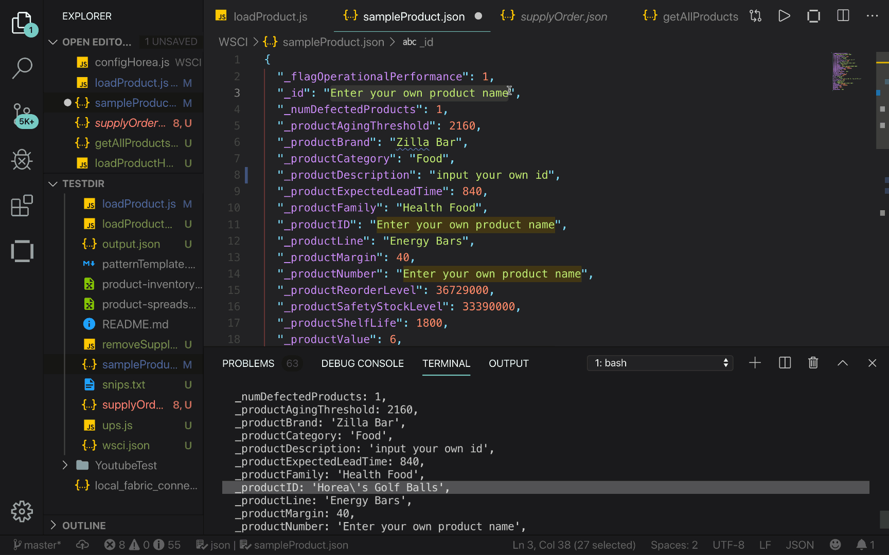
</p>
<br>

Go ahead and check out the [sampleProduct.json file](https://github.ibm.com/ibm-developer-emerging-tech/-supply-chain-insights/blob/master/sampleProduct.json)

It should look something like this: 

```json
{
  "_flagOperationalPerformance": 1,
  "_id": "Enter your own product name",
  "_numDefectedProducts": 1,
  "_productAgingThreshold": 2160,
  "_productBrand": "Zilla Bar",
  "_productCategory": "Food",
  "_productDescription": "Zilla Energy Bar 2oz. Special Edition",
  "_productExpectedLeadTime": 840,
  "_productFamily": "Health Food",
  "_productID": "Enter your own product name",
  "_productLine": "Energy Bars"
}
```

Go ahead and change the `_id` and `_productID` values to whatever you wish. I will
change them to something with my name. 

Once you modify and save the file, it should look something like this:

```json
{
  "_flagOperationalPerformance": 1,
  "_id": "Horea's IT services",
  "_numDefectedProducts": 1,
  "_productAgingThreshold": 2160,
  "_productBrand": "Zilla Bar",
  "_productCategory": "Food",
  "_productDescription": "Zilla Energy Bar 2oz. Special Edition",
  "_productExpectedLeadTime": 840,
  "_productFamily": "Health Food",
  "_productID": "HP-IT-2019"
}
```

 Save the file, and then run the script [loadProduct.js](https://github.com/horeaporutiu/supply-chain-insights/blob/master/loadProduct.js). The script 
 has a main function which calls two other functions.

 1. It calls a function which creates a product in Supply Chain Insights 
 by using the `sampleProduct.json` file.
 2. Next, it calls a function to lookup the product that was just created 
 by Id. The `_id` value from `sampleProduct.json` is used to query by ID.

 If all went well, you should see output like the following:

 ```bash
WSCI$ node loadProduct
  addProductRequest successful
  after product request
  id: 
  Horea's IT services
  getProductById response: 
  { _flagOperationalPerformance: 1,
    _id: 'Horea\'s IT services',
    _numDefectedProducts: 1,
    _productAgingThreshold: 2160,
    _productBrand: 'Zilla Bar',
    _productCategory: 'Food',
    _productDescription: 'input your own id',
    _productExpectedLeadTime: 840,
    _productFamily: 'Health Food',
    _productID: 'HP-IT-2019',
    _productLine: 'Energy Bars'
 ```
# Step 7. Use UPS APIs to add location and delivery estimate data 
Next, it's time to integrate with external systems to upload data into 
Supply Chain Insights. For this step, we're going to use UPS APIs. First,
you must get a [UPS account](https://www.ups.com/doapp/signup?loc=en_US). 

<br>
<p align="center">
  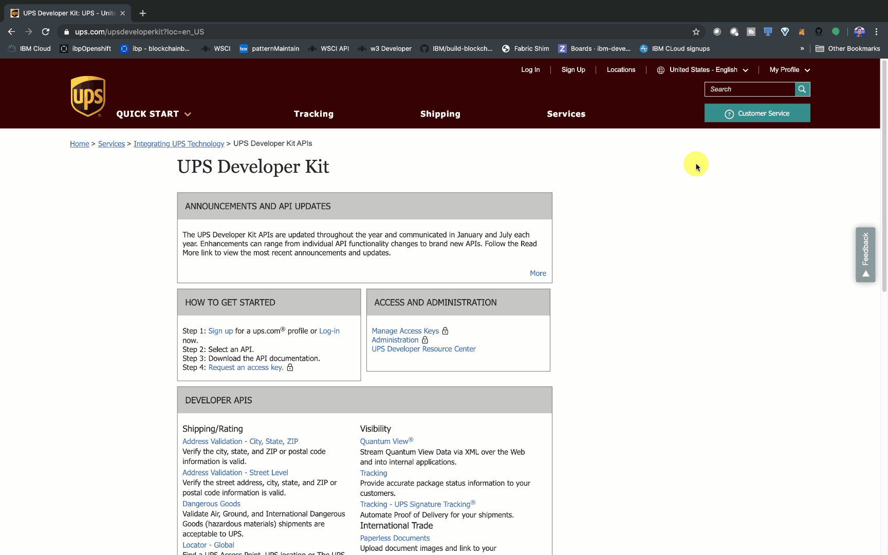
</p>
<br>

Once you've signed into your UPS account, let's go to the [UPS Developer Kit page](https://www.ups.com/upsdeveloperkit?loc=en_US). For now,
we will use the Tracking API to check in on our packages. But first, we must 
[request an access (API) key](https://www.ups.com/upsdeveloperkit/requestaccesskey?loc=en_US).

After you fill in the info, you can go ahead and click on **Request Access Key**.
Within a few seconds you should have your access key. Nice!

Now, let's do something with that API key. First, let's update `config.json` with
your API key. It should look something like this when all is said and done: 

```json
{
  "clientSecret": "your-client-secret-goes-here",
  "userSecret": "your-user-secret-goes-here",
  "clientId": "your-client-id-goes-here",
  "upsAccessKey": "DD6C9D67asdfbadsg5"
}
```

<br>
<p align="center">
  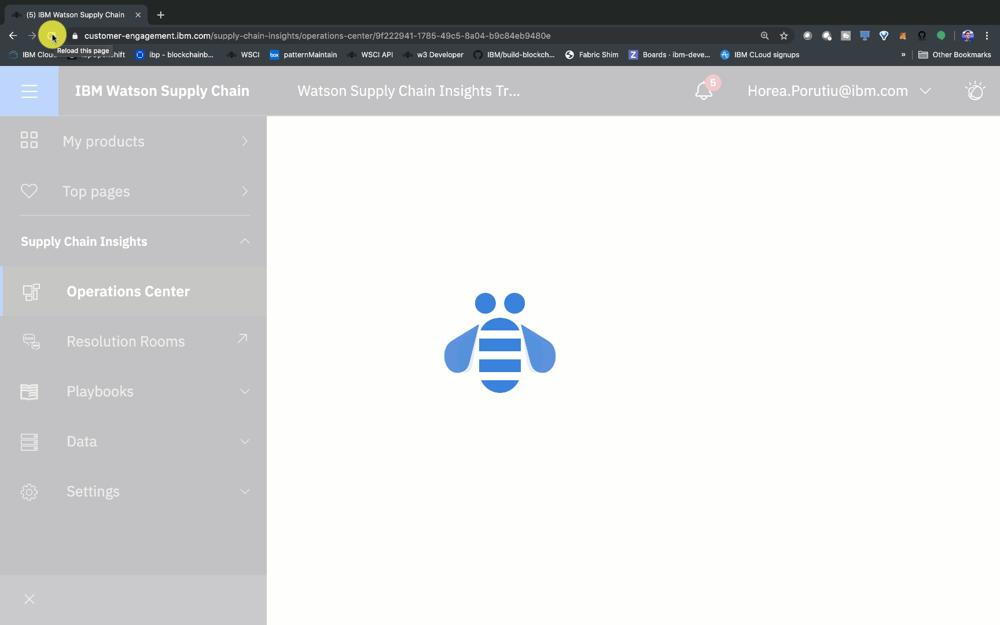
</p>
<br>

In your SCI account dashboard, click on the Watson icon in the top right corner of 
your screen. Type in the following command, to see if we have this sales shipment in
our platform:

`show me sales shipment "1Z12345E0205271688"`

Watson should say `I did not find any sales shipment related to "1Z12345E0205271688" from Demo Carrier.`

Before we run the `ups.js` script, go ahead and add in your UPS username 
and password in the following lines of the [ups.js script]().

Next, let's run the [ups.js script](https://github.com/IBM/supply-chain-insights/blob/master/ups.js#L39) by using the following 
command in terminal:

```bash
WSCI$ node ups.js 
```

This should add the sales shipment `1Z12345E0205271688` to our platform. 

If you look at the ups.js file, you'll see that first we get UPSInfo on 
a dummy shipment, and then we parse that shipment, get the date delivered
and the pickup date, and create a new sales shipment with those details 
in our platform.

Go ahead and ask Watson the same question:

`show me sales shipment "1Z12345E0205271688"`

And this time Watson should show you all of the shipment details, 
like the date delivered and the date created which we parsed 
from the UPS object.

Good job! You've just integrated with external APIs to add 
data to the platform. Integrating your whole supply chain system
into the SCI platform enables you to integrate with news and have a 
full end-to-end picture of any disruptions (advisories) that may 
impact your supply chain. You now have all the information you need to 
make the optimal decision to ensure all of your back-end processes are 
running as efficiently as possible.

## Extending the code pattern
This application can be expanded in a couple of ways:
* Automatically check for any shipment detail changes by invoking the 
UPS API every hour and update the SCI platform accordingly.
* Create custom skills for Watson to more easily query your data.

## Links
* [Supply Chain Insights Details](https://www.ibm.com/us-en/marketplace/supply-chain-insights/details)
* [ Supply Chain Insights API Explorer](https://developer.ibm.com/api/view/scinsights-prod:supply-chain-insights:title-Supply_Chain_Insights)

## License
This code pattern is licensed under the Apache Software License, Version 2. Separate third-party code objects invoked within this code pattern are licensed by their respective providers pursuant to their own separate licenses. Contributions are subject to the [Developer Certificate of Origin, Version 1.1 (DCO)](https://developercertificate.org/) and the [Apache Software License, Version 2](https://www.apache.org/licenses/LICENSE-2.0.txt).

[Apache Software License (ASL) FAQ](https://www.apache.org/foundation/license-faq.html#WhatDoesItMEAN)
